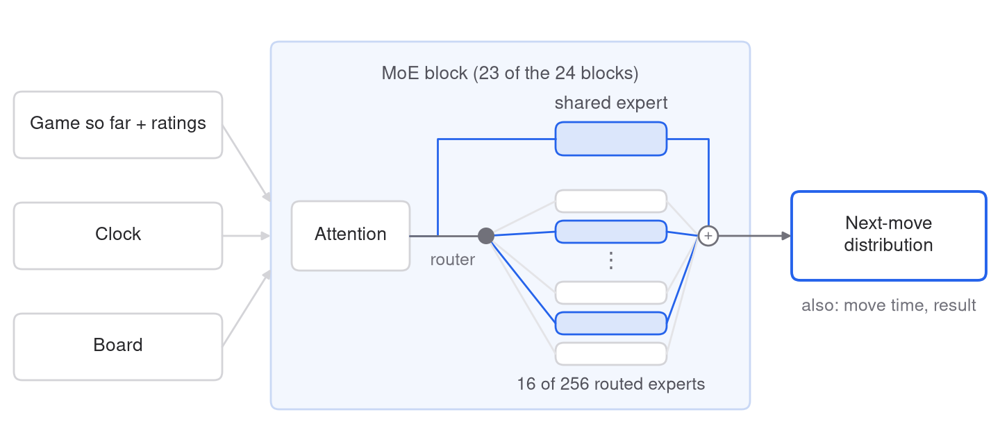
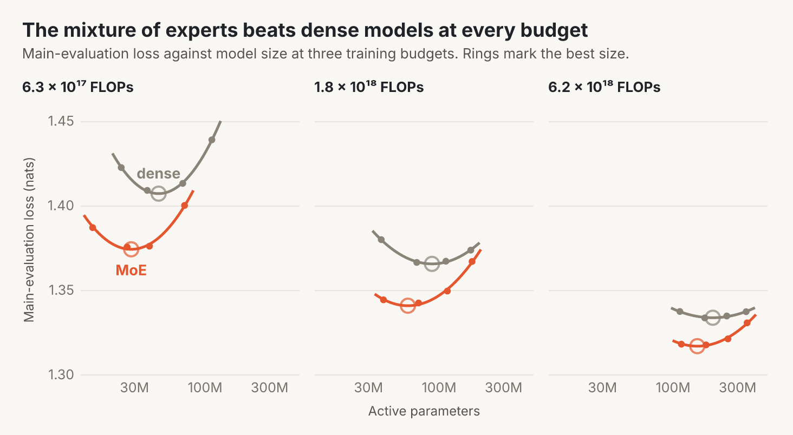
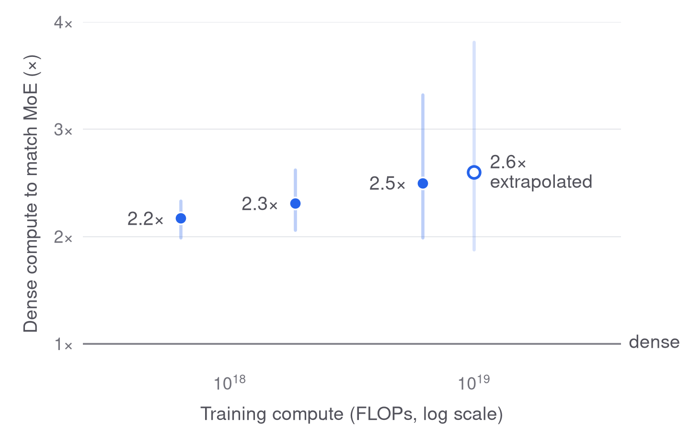
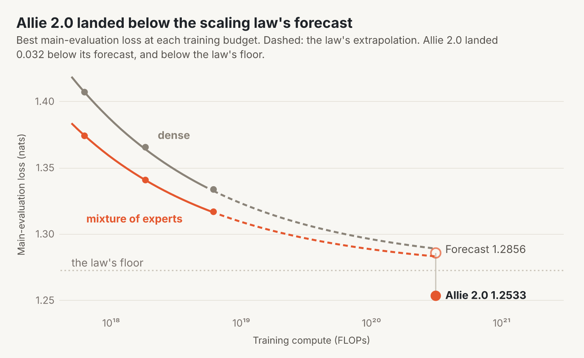
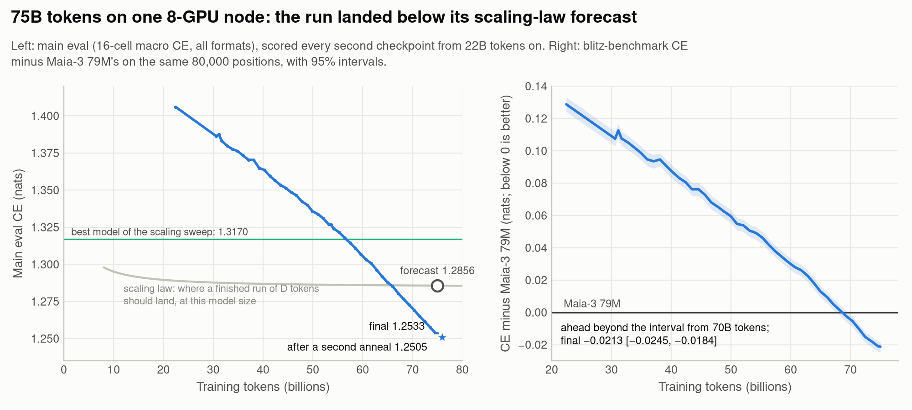
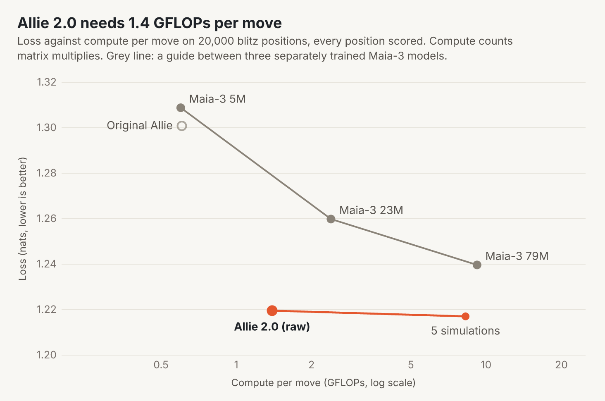
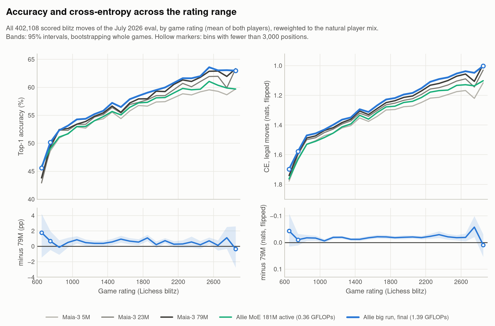

# Allie

> **Disclaimer:** I did not do any of this research. The experiments, code, analysis and this write-up were produced by AI agents (Claude Code and OpenAI Codex), with me setting goals and making calls. — Yiming

## What Allie is

Allie is a chess model that plays like a human. It predicts the move a person will make from the game so far, both players' ratings and the clock.

It follows our paper [Human-Aligned Chess With a Bit of Search](https://arxiv.org/abs/2410.03893), published at ICLR 2025. That model, the [original Allie](https://github.com/ippolito-cmu/allie), learned from blitz games only.

Allie 2.0 aims to cover every time control, from bullet to classical, and every level of play, experts included. So we judge it by how well it predicts the moves people actually played.

We measure this as a loss: how surprised the model is by each real move, in nats. Lower is better. We also report how often the model's top choice is the move that was played.

**Allie 2.0** is a transformer with 5.6B parameters, of which only 0.69B are used for each move. It trained on 75B tokens of online and over-the-board games.

Our main test set covers every time control and rating level. Its games come from July 2026, a month held out from training.

- Its loss on our main test set is **1.2533**, against 1.3526 for the original Allie.
- In blitz, its top choice is the move played **59.3%** of the time. For players rated 2400 and above, it is **63.0%**.
- It runs on an ordinary CPU: 6-9 ms per move on 8 cores of a recent server (a laptop's memory bandwidth
  allows about 10-20 ms).

You can [play it on Lichess](#play-against-allie-on-lichess) or [download it](#download-and-run-the-model).



*Most of Allie 2.0's blocks send each move to 16 of 256 small "experts", plus one shared expert.*

The model reads the game as a sequence of moves, with both ratings and the time control at the start. At each move it also sees the clocks and the board.

Besides the next move, it predicts how long the player will think and how the game will end.

## How we built it

### Scaling laws

Before training Allie 2.0, we trained 45 smaller models of two kinds: standard "dense" transformers and mixtures of experts. At each of three compute budgets, we varied the model size to find the best one.



*Loss against model size at three compute budgets. Rings mark the best size.*

The mixture of experts won at every budget. A dense model needs about 2.2 to 2.5 times the compute to match it.



*How many times more compute a dense model needs to match the mixture of experts.*

We then fit a scaling law in the style of [Chinchilla](https://arxiv.org/abs/2203.15556). It predicts the loss from the model's size and the number of training tokens.

The law forecast 1.2856 for Allie 2.0. Allie 2.0 scored 1.2533, below the law's limit for unlimited compute.



*Best loss at each training budget. Dashed: the law's extrapolation. Allie 2.0 landed 0.032 below its forecast.*

Allie 2.0's recipe isn't the reason: at small scale it is slightly worse than the sweep's. More likely, the law underestimates how far loss keeps falling with compute.

The law would have picked a bigger model trained on fewer tokens: 1.8B active parameters on 28B tokens. Instead we trained the largest model that fit on one 8-GPU machine, with 0.69B active parameters on 75B tokens.

### What else shaped it

We tested most choices on small models, one change at a time. The numbers are in [DETAILS](docs/DETAILS.md#design-findings).

- **Ratings matter most.** Hiding the players' ratings raised the loss by 0.067. For players rated 2400 and above, it rose by 0.111.
- **The clock helps when time is short.** Without the clock, the loss rose by 0.007 overall and by 0.022 late in blitz games.
- **Many small experts work best.** 256 small experts beat 128 larger ones. A shared expert that sees every move also helped.
- **A failed first run.** Our first full run broke down early: its router sent every move to the same few experts. Two small changes to how the router trains fixed it.
- **Borrowed defaults.** The model code comes from [modded-nanoGPT](https://github.com/KellerJordan/modded-nanogpt), which is tuned for short runs. Two of its defaults hurt here, and we changed them.
- **Recent games.** Giving recent months more weight did not help small models. A short final pass over 2024-2026 games did help Allie 2.0.

### Data

- **Online games.** Every Lichess month with clock times, from May 2017 to August 2026: 7.9B games.
- **Other games.** Over-the-board games from tournaments and broadcasts, plus a small share of engine games.
- **Held out.** No game from July 2026 is used in training. Both test sets come from that month.
- **More strong players.** Strong players are rare, so the sampler favors them. A game's weight doubles for every 200 rating points of its stronger player.
- **No over-use.** No game is used more than 8 times. Allowing 16 made the model memorize.

Favoring strong players lowered the loss for players rated 2400 and above by 0.017 to 0.024. It raised the loss for players under 1400 by 0.012 to 0.043.

### Training



*Loss on the main test set during training, against the scaling law's forecast.*

- **Hardware.** One machine with 8 NVIDIA L40S GPUs, for 6.6 days.
- **Length.** 75B tokens in 143,051 steps.
- **One crash.** At step 60,081, a near-zero number in the router made the update overflow. A small lower limit on that number fixed it.
- **A second version.** Allie 2.0 (annealed) adds a short extra pass over 1B tokens of recent games. It scores 1.2505 and is better on every time control.

## Comparison

We compare Allie 2.0 with the original Allie and with [Maia-3](https://arxiv.org/abs/2605.19091), from Ashton Anderson's group at the University of Toronto.

Maia-3 follows [Maia](https://arxiv.org/abs/2006.01855) and [Maia-2](https://arxiv.org/abs/2409.20553), the leading work on predicting human moves. We thank its authors for releasing the [weights](https://huggingface.co/collections/MaiaChess/maia3) and code, which made this comparison possible.

Maia-3 trains only on Lichess blitz games, so we compare on blitz. We use 80,000 blitz positions from July 2026, 20,000 from each of four rating bands. Each model gets its own kind of input, built the way its authors built it.

**Maia's protocol.** First we score every model the way the Maia-3 paper reports its results. It skips the first 10 plies of each game and drops every position after a player first has under 30 seconds.

On that protocol, Allie 2.0 and Maia-3 79M are close. Allie 2.0's loss is 1.208 against 1.218, and its top choice matches the played move 59.3% of the time against 59.1%, a gap within noise.

**All positions.** On every position, including the opening and time trouble, Allie 2.0 scores 1.206 against 1.227, with 59.3% against 58.8%. It does this at about a seventh of Maia-3 79M's compute per move. Full tables are in [DETAILS](docs/DETAILS.md#blitz-benchmark).



*Loss against compute per move. Blue: Allie 2.0 with 0, 5 or 128 steps of search.*



*Loss relative to Maia-3 79M, by the players' rating. Below zero is better.*

- **Across ratings.** On all positions, Allie 2.0 has a lower loss than Maia-3 79M in 22 of 23 rating bins.
- **The original Allie** matches Maia-3 79M at low ratings and falls behind as ratings rise.
- **Different inputs.** Allie reads the clock and the released Maia-3 does not. That helps most in time trouble, which Maia's protocol leaves out.
- **Where Maia-3 is better.** Maia-3 79M predicts better in the middlegame and with one to two minutes left.
- **Search.** Searching ahead helps Allie 2.0 a little. 128 search steps per move lower the loss by 0.0055, at about 126 times the compute.

Some caveats:

- **Not the same data.** Maia-3 trained on about 2.5 years of Lichess blitz. Allie 2.0 trained on every time control from 2017 to 2026.
- **Recent data.** Allie 2.0's training data runs up to the test month. August 2026 is in training; July 2026 is not.
- **Counted, not timed.** Compute here is counted from the model's size. Allie 2.0 also needs 11 GB of memory, against about 0.3 GB for Maia-3 79M.
- **The annealed version** had its learning rate chosen on these positions.
- **No search for the original Allie.** We score its plain predictions, without the search its paper adds.

More comparisons are in [DETAILS](docs/DETAILS.md#blitz-benchmark).

## Reproducing

The code is one Python package, [`allie`](src/allie). Training needs Linux and NVIDIA GPUs with CUDA 12.8.

Set `ALLIE_DATA` to the folder for the game data and test sets. Runs and scores go to `results/` in this checkout.

1. **Install.**
   ```sh
   git clone https://github.com/y0mingzhang/allie && cd allie
   uv sync              # add --extra search for tree search, --extra test for the tests
   ```
2. **Get the data.** Download each Lichess month from Hugging Face and build it:
   ```sh
   python -m allie.data.fetch 2024-01 raw/2024-01
   python -m allie.data.fastbuild build --hf raw/2024-01 --out $ALLIE_DATA/data-v1/2024-01
   python -m allie.data.fastbuild finalize --out $ALLIE_DATA/data-v1/2024-01
   ```
   Over-the-board and engine games go through `python -m allie.data.external`. Allie 2.0's exact data selection is in [configs/allie-2.0.json](configs/allie-2.0.json).
3. **Build the test set.** `python -m allie.eval.build`
4. **Train.** `allie-train configs/allie-2.0.json --nproc 8` needs eight 48 GB GPUs for about a week. It stops every two days; the same command resumes it.
5. **Evaluate.** `allie-eval --checkpoint results/pretrain/allie-2.0/last.pt` scores the main test set. The blitz comparison has its own scripts in `allie.eval.maia3`.
6. **Figures.** `python docs/make_figures.py` redraws every figure here.

Commands run inside the environment: prefix them with `uv run`, or activate `.venv`. Search has its own [guide](src/allie/search/README.md). More on the code is in [DETAILS](docs/DETAILS.md#reproducing).

## Play against Allie on Lichess

Allie 2.0 plays on Lichess as [**AllieTheChessBot**](https://lichess.org/@/AllieTheChessBot). Challenge it from its profile page.

- **Time controls.** Bullet to classical: 1 to 60 minutes, with up to 180 seconds of increment.
- **Games.** Rated or casual, standard chess from the starting position.
- **It plays at your level.** The bot takes on your rating. Then it plays a move a player of that rating would likely make.
- **It plays like a human opponent at your level.**
- **It thinks like a human.** Before each move, it waits about as long as a person would.
- **Availability.** It plays humans only, two games at a time and one game per opponent.

You can run your own bot from a clone of [this repository](https://github.com/y0mingzhang/allie). It needs only a CPU: under 10 ms per move on 8 server cores, and 6.4 GB of memory.

```sh
uv sync
export LICHESS_TOKEN=lip_...        # a bot account's token with the bot:play scope
allie-bot play --config configs/lichess-bot.toml --set model=PATH_TO_ALLIE_2.0
```

The [bot's guide](src/allie/lichess/README.md) covers bot accounts, settings and speed. A `strongest` mode plays the most likely move of a strong player.

## Download and run the model

The weights are on Hugging Face as [`yimingzhang/allie-2.0`](https://huggingface.co/yimingzhang/allie-2.0), an 11 GB download. It runs with `transformers` alone, on a CPU or a GPU:

```sh
pip install transformers torch python-chess
```

```python
from transformers import AutoModel

model = AutoModel.from_pretrained("yimingzhang/allie-2.0", trust_remote_code=True)
model.predict("1. e4 e5 2. Nf3", white_elo=1800, black_elo=1750, time_control="180+2")
model.play("1. e4 e5 2. Nf3", elo=1200)  # a move, sampled as a 1200 player would play it
```

`predict` gives every legal move's probability; `analyze` adds the win, draw and loss chances and the expected think time. On a CPU the weights load in int8 (6.4 GB, 6-9 ms a move on 8 cores of a recent server, with C++ kernels compiled for the machine on first use); on a GPU, in BF16 (about 7 ms, replayed CUDA graphs). This package has the same code, a command line (`allie-predict "1. e4 e5 2. Nf3" --elo 1800 --tc 180+2`) and the Lichess bot. See [src/allie/lichess/README.md](src/allie/lichess/README.md).

---

The project is MIT-licensed: see [LICENSE](LICENSE) and the upstream notices in [LICENSES.md](LICENSES.md). More detail is in [docs/DETAILS.md](docs/DETAILS.md).
