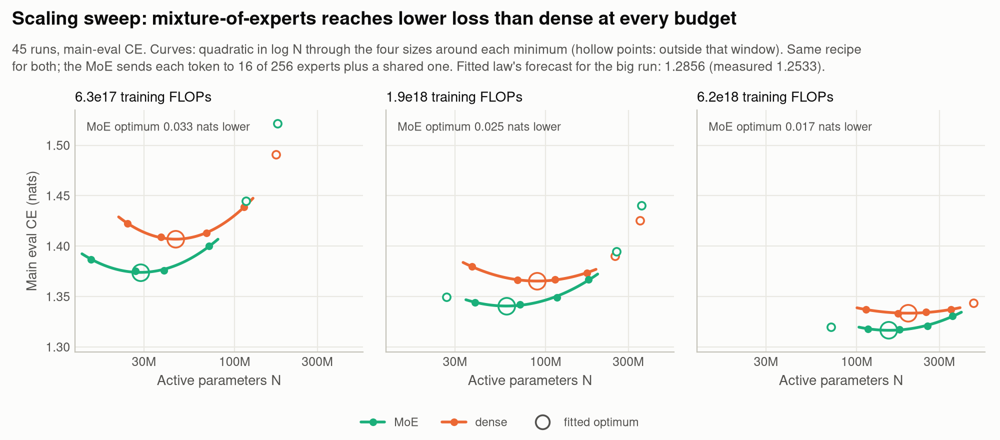
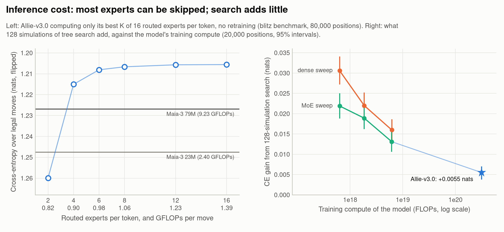
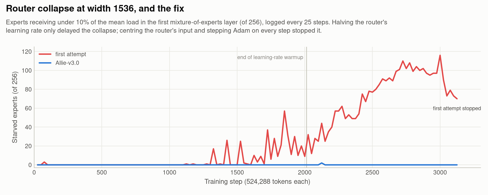
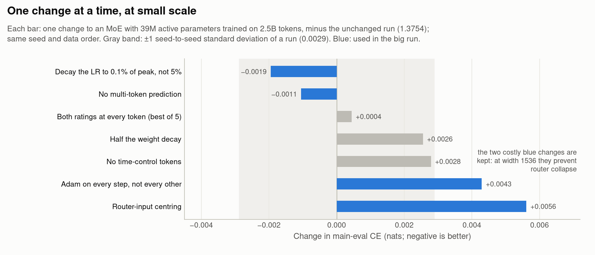

# Allie

Allie predicts the move a human chess player will make from the game so far, both players' ratings and the clock. The current model is a mixture-of-experts (MoE) transformer with 0.69B active and 5.6B total parameters, trained on 75B tokens of Lichess and over-the-board games. It continues the original Allie ([paper](https://arxiv.org/abs/2410.03893), [code](https://github.com/ippolito-cmu/allie)).

**On held-out Lichess blitz from July 2026, for each Maia-3 model (5M, 23M and 79M parameters) an Allie model reaches lower cross-entropy and higher top-1 accuracy at lower inference compute per move.** Compared with Maia-3 79M, the full model's cross-entropy is 0.0238 nats lower and its accuracy 0.48 points higher, at 6.6x less compute per move; fine-tuned to use 4 of its 16 experts per token, it still compares favourably at 10x less. On our all-format main evaluation it scored 1.2533 nats, 0.032 below its scaling-law forecast.

Maia-3 ([Chessformer, ICLR 2026](https://arxiv.org/abs/2605.19091); [models](https://huggingface.co/collections/MaiaChess/maia3)), from Ashton Anderson's group at the University of Toronto, is the state of the art in human-move prediction, after [Maia](https://arxiv.org/abs/2006.01855) (KDD 2020) and [Maia-2](https://arxiv.org/abs/2409.20553) (NeurIPS 2024). Its open release of weights and inference code is what made a like-for-like comparison possible. The comparison is not symmetric: Allie reads the clock and the released Maia-3 does not, our training data is more recent, and our compute is counted, not measured (see [Caveats](#caveats)).

| Maia-3 | GFLOPs/move | cheapest Allie model with lower CE and higher top-1 | GFLOPs/move | CE difference (nats) | top-1 difference (pp) |
|---|---:|---|---:|---:|---:|
| 5M | 0.60 | distilled student, MoE 181M active / 1.42B total | 0.36 | −0.0410 [−0.0446, −0.0374] | +0.96 [+0.74, +1.19] |
| 23M | 2.40 | big run fine-tuned to use 2 of 16 experts | 0.82 | −0.0270 [−0.0307, −0.0236] | +0.41 [+0.19, +0.64] |
| 79M | 9.23 | big run fine-tuned to use 4 of 16 experts | 0.90 | −0.0180 [−0.0215, −0.0149] | +0.34 [+0.12, +0.56] |

Allie minus Maia-3 on the same 80,000 positions, with 95% intervals over games: negative CE and positive top-1 differences mean Allie's predictions match the played move better. More numbers and detail: [docs/DETAILS.md](docs/DETAILS.md).

## How we measure

Both evaluations use Lichess games from July 2026, a month excluded from all training, and score cross-entropy (CE): the negative log-probability, in nats, of the move the human played. The **blitz benchmark** has 80,000 positions, 20,000 per band of the mover's rating (<1400, 1400-2000, 2000-2400, ≥2400), with probabilities renormalized over legal moves. Maia-3 runs from its public checkpoints on its own inputs (the current and 7 previous boards and both ratings), built exactly as the authors' code builds them. The **main evaluation**, which decided every training choice, averages CE over 16 cells (bullet, blitz, rapid and classical, each in the four rating bands, about 100,000 moves per cell) without legal-move masking.

## Comparison with Maia-3

The final checkpoint has lower CE than Maia-3 79M in 22 of 23 rating bins (intervals below zero in 19) and equal or higher accuracy in all but two, both within noise. The differences are largest where the setup favours Allie: bullet (−0.141 nats), which lies outside Maia-3's blitz training data, and positions with under 10 s on the clock (−0.223), where Allie reads the clock and the released Maia-3 does not. Maia-3 79M predicts better in the middlegame (plies 40-59, Allie +0.007 nats) and with one to two minutes left (+0.011), and on Maia-3's own protocol (ply > 20, at least 30 s left) the accuracy difference is within noise: +0.12 pp [−0.16, +0.40].

## Caveats

- **Not matched compute or data.** Maia-3 trained on about 2.5 years of Lichess blitz (January 2023 to July 2025; compute not published), Allie on all formats from 2017 to 2026 plus over-the-board and engine games, with 3.1e20 FLOPs. The claim is about inference cost.
- **Recency.** Our data runs up to the test month, and August 2026 (1.2% of tokens) is in training; July 2026 is excluded everywhere. The second anneal and the fine-tunes used only 2024-2026 months.
- **Different inputs.** The released Maia-3 checkpoints have no clock input and see 8 boards; Allie reads the clock and the whole game. Our largest gains are in time trouble.
- **FLOPs, not latency.** Allie's cost is analytic (2 × active parameters per move, with a cached game). Serving keeps all 5.6B weights resident (11 GB in BF16), against about 0.3 GB for Maia-3 79M.
- **Some choices were tuned on these positions:** the anneal's learning rate (two arms) and the fine-tune and distillation settings. The final checkpoint, which predates them, already has lower CE and higher accuracy than 79M (−0.0213 nats, +0.46 pp).
- **Thin data at the top.** Above game rating 2700 the test month has 43 games, and the big run is a single seed.

## The model

A game is a token sequence: an 11-token header (time control and both ratings as digits), then one token per move out of 1,968 possible moves. At every position, three clock features and a small CNN over the current board are added to the token embedding, and attention sees only the game's own history. The trunk descends from the [modded-nanoGPT](https://github.com/KellerJordan/modded-nanogpt) medium track: 24 blocks of width 1536. The first block has a dense MLP; the other 23 have a mixture-of-experts layer with 256 small experts, 16 chosen per token by a sigmoid router with load-balancing biases, plus one shared expert. One head predicts the next move and, as auxiliary targets, how long the move took and the game result. A move costs 1.39 GFLOPs with the game's key-value cache.

## Training

The data is every Lichess month with clock times from May 2017 to August 2026 except July 2026 (7.9B games, 616B tokens), plus over-the-board and engine games. A sampler doubles a game's weight for every 200 rating points of its stronger player, using no game more than 8 times. Training ran 143,051 steps of 524,288 tokens with NorMuon for the weight matrices and Adam for the rest, decaying the learning rate linearly to 0.1% of its peak, on one node of 8 NVIDIA L40S GPUs at 131K tokens/s for 6.6 days. The main eval reached 1.2533 (best sweep model: 1.3170); on the benchmark, its CE fell below Maia-3 79M's only at 70B of its 75B tokens. A second, low-learning-rate anneal on 1B tokens of recent months improved every format (main eval 1.2505).

## Scaling laws

Before the big run we trained 45 dense and MoE models at three budgets. The MoE reaches lower loss at every budget: dense models need 2.2x, 2.3x and 2.5x the compute to match it, although the gap between the fitted optima narrows (0.033, 0.025, 0.017 nats). A fitted law L(N, D) = E + A·N^−α + B·D^−β forecast 1.2856 for the big run; it scored 1.2533, below even the fitted floor E = 1.27. We don't know why yet. Our recipe changes don't explain it at small scale; a 50x extrapolation may simply exceed what the fit can pin down. Memory, not the law, set the model's size (the law's optimum: 1.8B active parameters on 28B tokens).

## Cheaper inference

The best 8 of the 16 experts carry nearly everything: computing only those costs 0.0011 nats, keeping 4 costs 0.0095, and a short distilled fine-tune that routes through only 4 (0.5B tokens) recovers two thirds of that. Distilling the big run into small students helps more the longer they train: −0.0017, −0.0031 and −0.0063 nats against a played-moves-only control at 0.25B, 0.75B and 1.5B tokens. Tree search fades with scale instead: 128 simulations gain 0.022, 0.019 and 0.013 nats on the sweep's MoE models and only 0.0055 on the big run.

## Training stability

The first attempt at the big run collapsed during warmup. In the first MoE layer one direction came to carry most of the router's input, routing became the same for every token, and up to 116 of 256 experts starved. Halving the router's learning rate only delayed it. Subtracting a running mean from the router's input, and stepping the Adam-trained parameters on every step rather than every other step (modded-nanoGPT's default), stopped it. At step 60,081 one token's 16 router scores summed to 6e-20 and the backward pass of the gate normalization overflowed; flooring that sum at 1e-12 fixed it.

## Ablations

modded-nanoGPT is tuned for short GPT-2 runs, so we tested its defaults one at a time on a small MoE. Dropping multi-token prediction and decaying the learning rate nearly to zero helped; halving weight decay and removing the time-control tokens hurt. Giving the model both ratings at every token, not just in the header, gained nothing: the moves themselves reveal a player's strength. The two router fixes cost 0.004-0.006 nats at this scale, where routers stay healthy; we keep them because the big run needs them. Every difference is within about two seed standard deviations, so read directions, not sizes.

## Next

The next run is an MoE with 1.2B active / ~9.2B total parameters (24 blocks of width 2048, the first three dense), 112B tokens, about 18 days on the same node with experts sharded across GPUs. Strong-player data now limits tokens: past about 110B, games of 2400+ players must either repeat more or take a smaller share, and both hurt the strongest cells. Beyond it, compute should go to parameters and to more strong-player data.

## Reproducing

[scripts/](scripts/) holds the data pipeline ([chessdata.py](scripts/chessdata.py), [chessmix.py](scripts/chessmix.py)), the trainer ([modded_train.py](scripts/modded_train.py)), the model (`modded_*.py`), the main evaluation ([eval_strat.py](scripts/eval_strat.py)) and [modelexp.py](scripts/modelexp.py), which freezes each experiment's code and data before it runs. [search/](search/README.md) is the inference engine with tree search. Data, checkpoints and results live outside git; [docs/DETAILS.md](docs/DETAILS.md#reproducing) lists where. [docs/make_figures.py](docs/make_figures.py) regenerates every figure. The project is MIT-licensed ([LICENSE](LICENSE)); code derived from modded-nanoGPT and the original Allie keeps its own MIT notices ([scripts/modded_medium_LICENSE](scripts/modded_medium_LICENSE), [search/ALLIE_LICENSE](search/ALLIE_LICENSE)).
