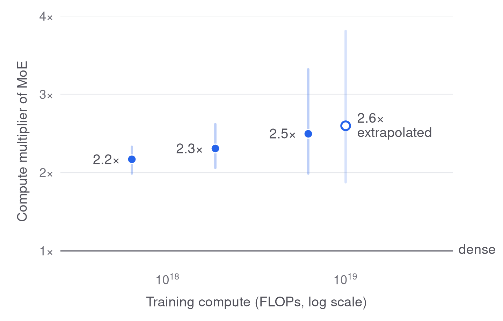

# Allie

> **Disclaimer:** I did not do any of this research. The experiments, code, analysis and this write-up were produced by AI agents (Claude Code and OpenAI Codex), with me setting goals and making calls. — Yiming

## What Allie is

Allie is a chess model that plays like a human. It predicts the move a person will make, given the game so far, both players' ratings and the clock.

It builds on our earlier paper, [Human-Aligned Chess With a Bit of Search](https://arxiv.org/abs/2410.03893) (ICLR 2025; [code](https://github.com/ippolito-cmu/allie)). That model, the original Allie, was trained on blitz games only.

The goal of this release is one model for every time control, from bullet to classical, that predicts human moves accurately at every level, strong and expert players included. So we measure move prediction directly: the cross-entropy (CE) of the move actually played, and how often the model's top move is that move.

**Allie 2.0** is a mixture-of-experts (MoE) transformer with 0.69B active and 5.6B total parameters, trained on 75B tokens of Lichess and over-the-board games.

- On our main evaluation (16 cells: four time controls × four rating bands, July 2026, held out from training) it scores **1.2533 nats**, against 1.3526 for the original Allie.
- On held-out blitz, its top move is the move played **59.3%** of the time, and **63.0%** for players rated 2400 and above. The original Allie's figures are 57.1% and 59.2%.
- A move costs 1.39 GFLOPs. The model runs on a CPU at about 80 ms per move.

You can [play it on Lichess](#play-against-allie-on-lichess) or [download it](#download-and-run-the-model).


*Inputs: the game so far as tokens, with a header carrying both ratings and the time control; three clock features; and a small CNN's reading of the board. The first block has an ordinary dense layer; the other 23 route each token to 16 of 256 small experts, plus a shared expert that sees every token (the drawing is schematic and omits the residual paths). One head predicts the next move and, as side targets, the time the move took and the game result.*

## Methods

### Scaling laws

Before training Allie 2.0, we trained 45 dense and MoE models at three compute budgets, from 6.3×10¹⁷ to 6.2×10¹⁸ FLOPs. At each budget we varied the model size and found the size with the lowest loss.


*Main-evaluation CE against model size at three training budgets. Each curve is a quadratic fit in log size through the four sizes around that budget's minimum (points are their seed means); rings mark the fitted minima.*

The MoE was better at every budget. A dense model needs 2.2 to 2.5 times the compute to match it, and the advantage grows slowly with scale.



*The compute a dense model needs to reach the MoE's loss, divided by the MoE's compute, from the two fitted laws. Bars are 90% intervals from refitting both laws to noise-resampled runs. The last point extrapolates beyond the sweep.*

We fit a scaling law, L(N, D) = E + A·N^−α + B·D^−β, to each family. N is active parameters and D is training tokens. The law predicted 1.2856 for Allie 2.0's size and token count. Allie 2.0 scored 1.2533, below even the law's fitted floor E = 1.27.


*Main-evaluation CE against training compute. Points are the sweep's isoflop minima; lines are each family's law at its compute-optimal size, dashed beyond the sweep. The hollow point is the law's forecast for Allie 2.0's actual size and tokens (1.2856); Allie 2.0 scored 0.032 lower, below the fitted floor.*

This is not a recipe effect. We re-ran Allie 2.0's recipe at the sweep's sizes, and it was slightly worse than the sweep's recipe there, by a margin that shrinks to about zero at Allie 2.0's compute. So the law's floor looks too high: more compute keeps paying.

The law also suggested a different shape. At Allie 2.0's compute, its extrapolated optimum is 1.8B active parameters on 28B tokens, far beyond the sizes it was fitted on. Memory decided instead: 24 blocks of width 1536, 0.69B active on 75B tokens, was the largest shape that trained on our 8-GPU node. A plot of the optimum is in [DETAILS](docs/DETAILS.md#scaling-laws).

### Other findings that shaped it

Most of these come from small models trained one change at a time. The numbers are in [DETAILS](docs/DETAILS.md#design-findings).

- **The rating goes in the header.** Replacing the players' ratings with the median rating costs 0.067 nats, and 0.111 on the 2400+ cells. Repeating both ratings at every move gained nothing.
- **The clock matters, mostly late.** Dropping the clock features costs 0.007 nats overall and 0.022 from move 40 of blitz games on. Continuous clock features beat bucketed ones. Removing the time-control tokens also hurt.
- **Many small experts.** 256 small experts beat 128 larger ones, by a margin that grows with scale. A shared expert at a quarter width helped. 512 experts were barely better and 20% slower.
- **Router collapse.** The first attempt at Allie 2.0 collapsed during warmup: routing became the same for every token, and up to 116 of 256 experts starved. Centring the router's input and stepping Adam on every step fixed it.
- **Inherited defaults.** The trunk comes from the [modded-nanoGPT](https://github.com/KellerJordan/modded-nanogpt) speedrun, tuned for short GPT-2 runs. Dropping multi-token prediction and decaying the learning rate nearly to zero helped here.
- **Recency.** Upweighting recent months did not help small models. A short second anneal on 2024-2026 games did help the final model, mostly on recent games.

### Data

- **Sources.** Every Lichess month with clock times, from May 2017 to August 2026: 7.9B games and 616B tokens. Over-the-board games (TWIC, PGN Mentor, Lichess broadcasts) and engine games (CCRL, TCEC, under 1% of tokens) are added.
- **Held out.** July 2026 is excluded everywhere. Both evaluations come from it.
- **Elo weighting.** The sampler doubles a game's weight for every 200 rating points of its stronger player and keeps the time controls at their natural shares. No game is used more than 8 times; a cap of 16 overfit.
- **Why.** Strong players are rare: games of 2400+ movers are about 3% of the data. Against the previous sampling rule, this "Elo ramp" lowered CE by 0.017 to 0.024 nats on every 2400+ cell, at a cost of 0.012 to 0.043 on the under-1400 cells.

### Training


*Main-evaluation CE over training, scored on checkpoints from 22B tokens on (earlier checkpoints were not scored), and the scaling law's forecast for the finished run.*

- **Run.** 143,051 steps of 524,288 tokens, on one node of 8 NVIDIA L40S GPUs: 131K tokens per second for 6.6 days.
- **Optimizers.** NorMuon trains the weight matrices and Adam the rest. The learning rate warms up for 2,013 steps, then decays linearly to 0.1% of its peak.
- **One incident.** At step 60,081, one token's router scores summed to 6e-20 and the backward pass overflowed. Flooring that sum at 1e-12 fixed it.
- **Allie 2.0 (annealed)** continues the final checkpoint with a second, short anneal on 1B tokens of recent months. It improved every time control and scored 1.2505 on the main evaluation.

## Comparison

We compare Allie 2.0 with the original Allie and with [Maia-3](https://arxiv.org/abs/2605.19091), from Ashton Anderson's group at the University of Toronto. Maia-3 is the latest of the Maia models, after [Maia](https://arxiv.org/abs/2006.01855) and [Maia-2](https://arxiv.org/abs/2409.20553), the leading line of work on human-move prediction. We thank its authors for releasing the [weights](https://huggingface.co/collections/MaiaChess/maia3) and inference code, which made a like-for-like comparison possible.

The comparison uses a **blitz benchmark**: 80,000 positions from July 2026, 20,000 in each band of the mover's rating. Probabilities are renormalized over the legal moves. Each model gets its own inputs, built as its authors' code builds them.

| Model | Parameters | GFLOPs/move | CE (nats) | Top-1 (%) |
|---|---|---:|---:|---:|
| Maia-3 5M | 5.2M | 0.60 | 1.2955 | 56.95 |
| Maia-3 23M | 22.9M | 2.40 | 1.2475 | 58.34 |
| Maia-3 79M | 78.9M | 9.23 | 1.2269 | 58.80 |
| Original Allie | 305M | 0.61 | 1.2848 | 57.06 |
| Allie 2.0 | 0.69B active / 5.6B total | 1.39 | 1.2056 | 59.26 |
| Allie 2.0 (annealed) | 0.69B active / 5.6B total | 1.39 | 1.2030 | 59.29 |


*Legal-move CE (lower is better) against inference compute, on the 20,000 benchmark positions where we also ran search, so values differ slightly from the table. The grey line is a guide between three separately trained Maia-3 models; the blue line is one model, Allie 2.0, with 0, 5 or 128 simulations of tree search. Compute is counted forward-pass FLOPs with a cache, not measured time.*


*CE relative to Maia-3 79M by game rating, on every scored blitz move of the main evaluation; below zero is better. The band is Allie 2.0's 95% interval; the bins at both ends hold few games, so they are noisy.*

- **Across ratings.** Allie 2.0's CE is lower than Maia-3 79M's in 22 of 23 rating bins. The original Allie is close to Maia-3 79M at low ratings and falls behind as ratings rise.
- **Where the setup differs.** Allie reads the clock and the released Maia-3 does not. The largest differences are in time trouble and in bullet, which Maia-3 did not train on. Maia-3 79M predicts better in the middlegame (plies 40-59) and with one to two minutes left. On Maia-3's own protocol (after ply 20, at least 30 seconds left) the accuracy difference is within noise.
- **Search.** Tree search over Allie 2.0's own predictions helps a little: 128 simulations lower CE by 0.0055 nats, at about 126 times the compute, mostly for players rated 2000 and above.
- **The original Allie** is scored from its raw policy, without the time-adaptive search its paper adds. It has no clock input and trained on 2022 blitz only.

Caveats:

- **Not matched data or compute.** Maia-3 trained on about 2.5 years of Lichess blitz, and its training compute is not published. Allie 2.0 trained on all time controls from 2017 to 2026, with 3.1×10²⁰ FLOPs.
- **Recency.** Allie 2.0's data runs up to the test month; August 2026 (1.2% of tokens) is in training, July 2026 is not.
- **FLOPs, not latency.** Serving Allie 2.0 keeps all 5.6B weights in memory: 11 GB in BF16, against about 0.3 GB for Maia-3 79M.
- **The anneal was tuned on these positions.** Its learning rate was picked between two values on the benchmark. Allie 2.0 itself predates that choice.

More comparisons, with intervals, are in [DETAILS](docs/DETAILS.md#blitz-benchmark).

## Reproducing

The code is one Python package, [`allie`](src/allie):

- `data`: game stores, the training-time sampler, tokenization
- `model`: the transformer, the mixture-of-experts layer and its kernels, the board CNN
- `train`: trainer, schedule, checkpoints
- `eval`: the main evaluation and the blitz benchmark
- `search`: the tree-search engine
- `lichess`: the Lichess bot, with a CPU inference engine
- `experiments`: frozen studies on Slurm, scaling-law fits

Training needs Linux and CUDA 12.8 GPUs. `ALLIE_DATA` points at the game stores and evaluation sets; `ALLIE_PROJECT_ROOT` is where `results/` receives runs and scores (default: this checkout).

1. **Install.** `git clone https://github.com/y0mingzhang/allie && cd allie`, then `uv sync` installs the package and PyTorch 2.10. Add `--extra search` for tree search and `--extra test` for the tests; `uv run pytest` skips checks whose GPU or data is missing. The commands below run in that environment (`uv run ...` or an activated `.venv`).
2. **Get the data.** Lichess games come from the monthly database on Hugging Face (`Lichess/standard-chess-games`). We use every month with clock annotations from May 2017 to August 2026, except the test month, July 2026. For each month:
   ```sh
   python -m allie.data.fetch 2024-01 raw/2024-01                  # download, sha256-verified
   python -m allie.data.fastbuild build --hf raw/2024-01 --out $ALLIE_DATA/data-v1/2024-01
   python -m allie.data.fastbuild finalize --out $ALLIE_DATA/data-v1/2024-01
   ```
   Over-the-board games (TWIC, PGN Mentor, Lichess broadcasts) and engine games (CCRL, TCEC) go through `python -m allie.data.external fetch SOURCE`, then `parse` and `finalize`. `allie.data.history` counts the games per bucket, and `allie.data.inventory` builds sampling tables such as the Elo ramp. Allie 2.0's months, stores, counts and table are in [configs/](configs/allie-2.0.json).
3. **Build the main evaluation.** `python -m allie.eval.build` builds the July 2026 evaluation, 16 cells, leaving out the original Allie's dev and test games.
4. **Train Allie 2.0.** Run `allie-train configs/allie-2.0.json --nproc 8` on one node of eight 48 GB GPUs (on NVIDIA L40S: 131K tokens/s, 6.6 days). The run stops after each 2-day chunk (`max_seconds`), and the same command resumes it.
5. **Evaluate.** `allie-eval --checkpoint results/pretrain/allie-2.0/last.pt` writes the 16 cells to `results/lm-eval/allie-2.0/strat-v1.json`. The blitz benchmark samples its positions with `allie.eval.maia3.positions` and `legal`. It then scores Maia-3 with `allie.eval.maia3.score_maia3` (with the Maia-3 code at `MAIA3_REPO`) and Allie with `allie.eval.maia3.score_moe`.
6. **Search.** See [src/allie/search/README.md](src/allie/search/README.md).
7. **Figures.** `python docs/make_figures.py` regenerates every figure here from the result files.

## Play against Allie on Lichess

Allie 2.0 plays on Lichess as [**AllieTheChessBot**](https://lichess.org/@/AllieTheChessBot). Challenge it from its profile page.

- **Time controls.** Bullet, blitz, rapid and classical: 1 to 60 minutes, with 0 to 180 seconds of increment. Rated or casual, standard chess from the starting position.
- **It plays at your level.** The bot sets its own rating to yours, then samples a move from what Allie 2.0 predicts a player of that rating would play. It is not trying to win at all costs; it is trying to play like you.
- **It takes human time.** Before each move it waits a think time drawn from the model's own prediction for that position and clock.
- **Availability.** It plays humans only, one game per opponent and two games at a time.

To run your own bot from a clone of [this repository](https://github.com/y0mingzhang/allie), `allie-bot` needs only a CPU: about 80 ms and 11 GB of memory per move in BF16, or 40 ms and 7.7 GB with int8 weights.

```sh
uv sync
export LICHESS_TOKEN=lip_...        # a bot account's token with the bot:play scope
allie-bot play --config configs/lichess-bot.toml --set model=PATH_TO_ALLIE_2.0
```

The config sets the accepted challenges and the playing style; a `strongest` mode plays the most likely move of a strong player, optionally with search. [src/allie/lichess/README.md](src/allie/lichess/README.md) covers bot accounts, settings, speed and accuracy.

## Download and run the model

The weights will be on Hugging Face as [`yimingzhang/allie-2.0`](https://huggingface.co/yimingzhang/allie-2.0), in the format `allie-bot` reads (`model.safetensors` and `config.json`, 11 GB in BF16).

TODO: download and inference instructions, once the repository is published.

---

The project is MIT-licensed ([LICENSE](LICENSE)); upstream notices are in [LICENSES.md](LICENSES.md). More detail is in [docs/DETAILS.md](docs/DETAILS.md).
