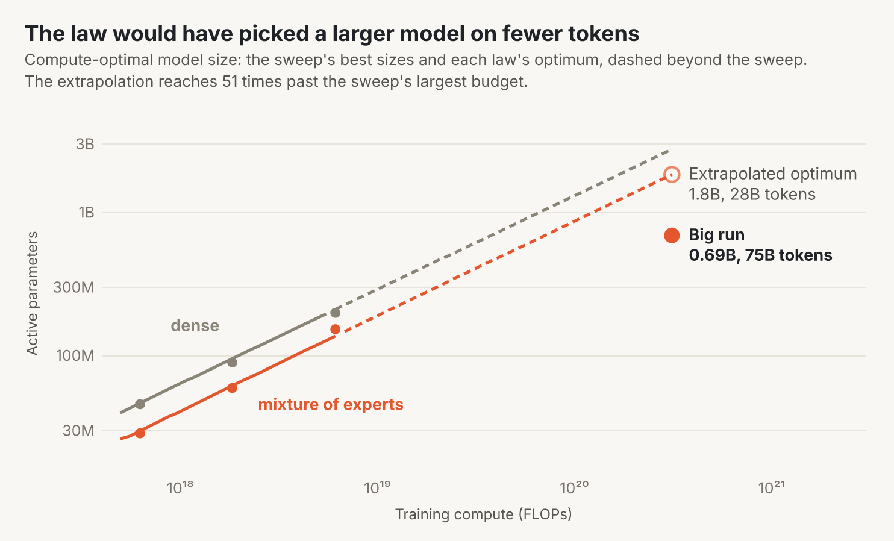

# Allie: details

> Researched and written by AI agents (Claude Code and OpenAI Codex), with Yiming Zhang setting goals and making calls.

The numbers behind the [README](../README.md).

The loss is cross-entropy (CE) in nats: the negative log-probability of the move played. Intervals are 95%, from 2,000 bootstrap draws over whole games. Differences between models are paired on the same positions.

## Blitz benchmark

The benchmark is 80,000 blitz positions from July 2026, 20,000 per band of the mover's rating: under 1400, 1400-2000, 2000-2400 and 2400+. Probabilities are renormalized over the legal moves.

Allie 2.0 is the final training checkpoint. Allie 2.0 (annealed) continues it with a second anneal (see [Training](#training)).

| Allie 2.0 minus | CE | top-1 (points) |
|---|---:|---:|
| Maia-3 5M | −0.0899 [−0.0938, −0.0863] | +2.31 [+2.07, +2.54] |
| Maia-3 23M | −0.0419 [−0.0454, −0.0387] | +0.92 [+0.71, +1.14] |
| Maia-3 79M | −0.0213 [−0.0245, −0.0184] | +0.46 [+0.24, +0.67] |

| Allie 2.0 (annealed) minus | CE | top-1 (points) |
|---|---:|---:|
| Maia-3 5M | −0.0925 [−0.0964, −0.0887] | +2.33 [+2.10, +2.59] |
| Maia-3 23M | −0.0444 [−0.0480, −0.0412] | +0.95 [+0.75, +1.17] |
| Maia-3 79M | −0.0238 [−0.0272, −0.0208] | +0.48 [+0.27, +0.70] |

Compute per move counts forward-pass FLOPs with the game so far cached, not measured time. Allie 2.0's top-1 accuracy is 63.0% on the 2400+ band.

### Where the differences come from

Allie 2.0 minus Maia-3 79M on slices of the benchmark. The bullet, rapid and classical rows use 5,000 positions per rating band. The other rows are blitz.

| Slice | positions | CE difference | top-1 difference (points) |
|---|---:|---:|---:|
| bullet | 20,000 | −0.1412 [−0.1514, −0.1310] | +3.33 [+2.81, +3.83] |
| rapid | 20,000 | −0.0163 [−0.0222, −0.0102] | +0.53 [+0.11, +0.94] |
| classical | 20,000 | −0.0208 [−0.0278, −0.0144] | +0.45 [−0.00, +0.90] |
| mover has under 10 s left | 2,852 | −0.2229 [−0.2627, −0.1823] | +3.47 [+1.88, +4.91] |
| mover has 60-120 s left | 15,719 | +0.0107 [+0.0034, +0.0182] | −0.53 [−1.06, −0.02] |
| plies 40-59 | 15,997 | +0.0071 [+0.0003, +0.0137] | −0.09 [−0.62, +0.42] |
| Maia-3's protocol: ply > 20, at least 30 s left | 48,987 | −0.0057 [−0.0095, −0.0019] | +0.12 [−0.16, +0.40] |

### By rating

The rating plot uses every scored blitz move of the main evaluation: 402,108 positions in 6,247 games. They are reweighted to the natural mix of players and grouped by game rating in 100-point bins.

Allie 2.0's whole CE interval is below Maia-3 79M's in 19 of 23 bins. The exceptions are 600-700, 700-800, 1000-1100 and 2800-2900. Only the last, with 7 games, has a higher point estimate.

Its accuracy is lower in two bins, both within noise: 800-900 by 0.12 points and 2800-2900 by 0.33 points. The bins at both ends hold few games.

### The original Allie

We score the original Allie's raw policy on the same positions, in its own input format. It sees both ratings and a time-control token before the moves, and no clock.

- **Checkpoint.** `medium/best.pt` from [yimingzhang/allie-models](https://huggingface.co/datasets/yimingzhang/allie-models), with 305M parameters, trained on 2022 Lichess blitz.
- **A retrain.** It is not the exact model behind the paper's stored outputs. It reproduces its training run's validation loss of 1.3535, and the paper's test accuracy: 55.73% against 55.7% reported.
- **Benchmark.** CE 1.2848 [1.2748, 1.2941] and top-1 57.06% [56.70, 57.42].
- **By rating band.** CE 1.4256, 1.2947, 1.2320 and 1.1870 from the lowest band to the highest. Top-1 is 59.20% on the 2400+ band.
- **Maia-3's protocol.** CE 1.2778 and top-1 57.36%.
- **Main evaluation.** 1.3526, against Allie 2.0's 1.2533. Only blitz is in its training data, so bullet, rapid and classical games get its unknown time-control token.
- **Compute.** 0.61 GFLOPs per move with a cache, counted as for the other models. Its released decoder has no cache: it re-reads the game for each move, about 28 GFLOPs at the benchmark's mean ply.
- **Search.** Its time-adaptive search averages 50 such passes per move. We do not score it.
- **Input mapping.** 3 of 6,191 benchmark games, 35 positions, use a time control outside its 24 blitz tokens and get the unknown token. The model clamps ratings to 500-3000.

## Search

The search runs over the model's own predictions of the move, the outcome and the thinking time. We ran it on 20,000 benchmark positions, 5,000 per rating band. The README's compute plot uses these positions, so its values differ slightly from the 80,000-position table.

Each search budget's output is calibrated on separate July 2026 games, which do not overlap the benchmark.

| Allie 2.0 | GFLOPs per move | CE | CE gain | top-1 gain (points) |
|---|---:|---:|---:|---:|
| raw policy | 1.40 | 1.2216 | | |
| 5 simulations | 8.30 | 1.2189 | +0.0026 [+0.0014, +0.0039] | +0.15 [−0.08, +0.37] |
| 128 simulations | 176 | 1.2161 | +0.0055 [+0.0038, +0.0070] | +0.18 [−0.04, +0.40] |

On the same positions, Maia-3 5M, 23M and 79M score 1.3086, 1.2597 and 1.2395. The original Allie scores 1.3006.

The gain comes from strong players. With 128 simulations it is −0.0001 below 1400 and +0.0014 at 1400-2000. It is +0.0062 at 2000-2400 and +0.0143 at 2400+.

Search helps less as models grow. 128 simulations gain 0.022, 0.019 and 0.013 nats on the scaling sweep's best MoE models, and 0.0055 on Allie 2.0.

## Evaluation

**Benchmark positions.** They come from the main evaluation's 402,108 scored blitz moves, rebuilt into games. Every target move replays as legal. We drew a fixed random sample of 20,000 per rating band before any model ran.

**Maia-3.** It runs unmodified from its public 5M, 23M and 79M checkpoints ([paper](https://arxiv.org/abs/2605.19091), [models](https://huggingface.co/collections/MaiaChess/maia3), [code](https://github.com/CSSLab/maia-chess), AGPL-3.0).

- It receives the current board and the 7 previous ones, from the mover's side, and both players' ratings.
- Our scorer reproduces the authors' engine move for move and probability for probability.
- Allie receives the whole game, both ratings and the clock, in one forward pass per game.

**Main evaluation.** 16 cells: bullet, blitz, rapid and classical, each in the four rating bands.

- About 100,000 scored moves per cell: 1.55M moves in 26,278 games. Classical 2400+ uses all 37,180 available moves.
- Rated human games only. Bot accounts and games that leak into validation are excluded.
- CE is over all 1,968 move tokens, without legal-move masking. The headline number is the plain mean of the 16 cells.

## The model

- **Tokens.** An 11-token header: start, base time, increment, and each rating as four digits. Then one token per move, from-square and to-square plus promotion. Games are packed into 16K-token rows, and attention stays within each game.
- **Clock inputs.** At every position the model gets the mover's and the opponent's time left, and the mover's previous thinking time, as Fourier features of log seconds. 10% of training games leave them out.
- **Board input.** A small CNN over 13 piece planes: three 3×3 convolutions with 32 channels, a 1×1 squeeze, and castling and en-passant features.
- **Trunk.** 24 blocks of width 1536, with 24 heads of 64. It keeps modded-nanoGPT's QK-normalized attention, partial rotary positions, gated attention outputs, value embeddings, U-net skips, re-injected input embeddings and soft-capped logits.
- **Experts.** Block 1 has a dense MLP. Blocks 2-24 have 256 routed SwiGLU experts of hidden width 192, plus a shared expert of width 1024. The active width, 16 × 192 + 1024 = 4096, matches the dense block.
- **Routing.** Sigmoid router scores pick the top 16 after a balancing bias, and the chosen gates are scaled to sum to 4. Quantile balancing (Kimi K3) resets the biases every step, with a small sequence-level balance loss. No token is dropped.
- **Router fixes.** The router's input is centred by a running mean with decay 0.9. The gate sum is floored at 1e-12.
- **Head.** The objective is the next move. Two side targets have loss weight 0.2 each: the move's thinking time in 63 bins, and the game result from the mover's side.
- **Cost.** 1.39 GFLOPs per move with the game cached. Of this, 0.74 is fixed and each routed expert adds 0.041.

## Training

**Data.**

- 111 Lichess months, from May 2017 to August 2026 without July 2026: 7.87B games and 616B tokens.
- August 2026, the month after the test month, is 1.2% of training tokens.
- Over-the-board games: 5.1M from TWIC, PGN Mentor and Lichess broadcasts.
- Engine games: 4.6M from CCRL and TCEC, under 1% of tokens.
- The sampler draws games from monthly shards bucketed by rating, and tokenizes them on the fly.
- Its *Elo ramp* table doubles a game's weight per 200 points of its stronger player. Time controls keep their natural shares, and no game is used more than 8 times.

**Optimization.**

- NorMuon, a Muon variant, for all weight matrices, experts included.
- Adam, stepping every step, for the embeddings, head, routers, board CNN and clock table.
- 2,013 warmup steps, then a linear decay to 0.1% of the peak learning rate. No multi-token prediction.
- BF16 matrix multiplies with FP32 master weights.

**Systems.**

- One node with 8 NVIDIA L40S GPUs of 48 GB. Data parallel, with the optimizer state sharded.
- Four 16K-token rows per GPU per micro-batch, activation recompute and fused Triton expert kernels.
- A median of 131K tokens per second, about 19% of peak BF16 throughput.
- 159 hours in 2-day jobs, resuming from checkpoints saved every 1,024 steps.

**Second anneal (Allie 2.0 annealed).**

- It starts from Allie 2.0 with a fresh optimizer, on 1B tokens of January 2024 to June 2026 plus August 2026.
- The peak learning rate is 0.05, the main schedule's value at 99%. It decays over the last 30%. A peak of 0.2 gained nothing.
- The main evaluation improved by 0.0028, with every time control better. The benchmark improved by 0.0026 [0.0019, 0.0033].

## Scaling laws

The sweep has 45 runs, dense and MoE, at 6.3×10¹⁷, 1.9×10¹⁸ and 6.2×10¹⁸ training FLOPs. Each budget has five to seven sizes, from 8 to 24 blocks and widths 384 to 1280. Eleven repeats with a second seed put the seed-to-seed standard deviation at 0.0029.

At each budget, a quadratic in log size is fit through the four sizes around the minimum. The isoflop plot shows those sizes' seed means, and its rings mark the fitted minima.

We fit L(N, D) = E + A (N/10⁷)^−α + B (D/10⁸)^−β. N is active non-embedding parameters and D is training tokens. Intervals here are 90%:

| family | E | α | β | rms error |
|---|---|---|---|---:|
| MoE | 1.27 [1.26, 1.28] | 0.54 [0.42, 0.67] | 1.06 [1.01, 1.11] | 0.0026 |
| dense | 1.27 [1.26, 1.29] | 0.54 [0.44, 0.66] | 1.03 [0.95, 1.10] | 0.0020 |

- A dense model needs 2.17x [1.99, 2.33], 2.31x [2.06, 2.62] and 2.50x [1.99, 3.32] the MoE's compute to match it at the three budgets. These come from the two laws. The intervals refit both laws to noise-resampled runs.
- E is the law's limit for unlimited compute. B and β are correlated at 0.98 in the fit.
- Allie 2.0 has N = 0.69B and D = 75B, 109 tokens per parameter. It was forecast at 1.2856 and scored 1.2533.
- The compute-optimal size grows as C^0.66.

*Compute-optimal model size: the sweep's best sizes and each law's optimum, dashed beyond the sweep.*

At Allie 2.0's compute, the law's MoE optimum is 1.8B active parameters on 28B tokens. That is 51 times the sweep's largest budget and 3.9 times the largest size it was fit on, so treat it as a direction, not a validated choice. Beyond the swept sizes, training FLOPs per parameter and token are held at the largest size's value.

The optimum is flat: half that size costs 0.0013. The largest shape that trained on the 8-GPU L40S node was 24 blocks of width 1536.

**Recipe re-run.** We re-ran Allie 2.0's recipe at the sweep's sizes and compared it with the sweep's recipe. Positive means Allie 2.0's recipe is worse:

| Budget | Shape | Main evaluation | 2400+ cells |
|---|---|---:|---:|
| 6.3×10¹⁷ FLOPs | 12 blocks × 512 | +0.0082 | +0.0104 |
| 6.2×10¹⁸ FLOPs | 18 blocks × 896 | +0.0058 | +0.0086 |
| 6.2×10¹⁸ FLOPs | 20 blocks × 1024 | +0.0042 | +0.0074 |

The gap shrinks by about 0.003 per tenfold of compute. It extrapolates to about −0.002 at Allie 2.0's 3.1×10²⁰ FLOPs. So the 0.032 below the forecast comes from the law's form, not from the recipe.

## Design findings

Small-model results behind the README's choices. Changes are in main-evaluation CE, where negative is better. "2400+" is the mean of the four 2400+ cells.

**Inputs.**

- Replacing both header ratings with the median rating: +0.067, and +0.111 on 2400+.
- Repeating both ratings at every move: +0.0004 to +0.0019. Also repeating the time control: +0.0012 to +0.0055.
- Dropping the clock features: +0.007 overall, and +0.022 from ply 80 of blitz games on.
- Continuous Fourier clock features against bucketed ones: −0.0039.
- Removing the time-control tokens: +0.0028 (see [Ablations](#ablations)).

**Mixture of experts.**

- 256 experts with 12 active against 128 with 6: the 128-expert model needs 1.04× to 1.34× the compute to match, and the gap grows with scale.
- 512 experts with 24 active: −0.0019, but about 20% slower. 64 experts lose.
- A shared expert at a quarter of the block width was the best tested, worth 1.13-1.15× compute. Without one: 0.89-1.06×.
- Quantile balancing of the routing biases: no change in loss. Starved experts fell to zero, so we kept it.

**Data.**

| Change | Effect |
|---|---|
| Elo ramp against the previous sampling rule: 2400+ bullet, blitz, rapid, classical | −0.024, −0.022, −0.020, −0.017 |
| Elo ramp against the previous sampling rule: under-1400 cells | +0.012 to +0.043 |
| Use cap of 16 instead of 8 | +0.033 (overfits) |
| Over-the-board games upweighted 4× | a tie |
| Engine games upweighted 4× | no gain |
| Engine games removed | +0.0023 |
| Recent months upweighted 2× or 4× | −0.0012 to +0.0022 |

- The Elo ramp was better in 10 of 16 cells. It showed no sign of memorization, although 62% of the 2800+ games the model saw were repeats.
- Engine games stay at under 1% of tokens. The mix stays uniform over time.
- The second anneal on 2024-2026 months did help the final model: −0.0028 on the main evaluation. On validation games it was −0.0031 for 2024 onward and +0.0020 before 2023.

## Ablations

One change at a time to an MoE with 39M active parameters, trained on 2.5B tokens with the same seed and data order. Each row is the change in main-evaluation CE against the unchanged run, which scored 1.3754.

One seed-to-seed standard deviation is 0.0029, so read directions, not sizes.

| Change | Main-evaluation CE | In Allie 2.0 |
|---|---:|:---:|
| Decay the learning rate to 0.1% of peak, not 5% | −0.0019 | yes |
| No multi-token prediction | −0.0011 | yes |
| Both ratings at every token (best of 5 settings) | +0.0004 | |
| Half the weight decay | +0.0026 | |
| No time-control tokens | +0.0028 | |
| Adam on every step, not every other | +0.0043 | yes |
| Router-input centring | +0.0056 | yes |

The two router changes cost a little at this scale, where routers stay healthy. Allie 2.0 keeps them because at width 1536 they prevent router collapse.

## Training stability

**Router collapse.**

- In the first attempt, the first block's attention output came to carry a large, near-constant vector.
- The first MoE layer's router scores then became a fixed offset per expert. The capped balancing biases could not compensate.
- Starved experts rose from about step 1,200 to 116 of 256.

Short test runs from scratch, with the same data order, isolated the fix:

- Half the router learning rate, plus a shorter multi-token phase, collapsed 100-300 steps later.
- Centring alone left the load uneven. At step 2,600 the busiest expert had 3.8x the mean load, against 2.1x with both fixes.
- Centring plus Adam on every step stayed healthy.

The final run uses all three changes. It also drops multi-token prediction, whose phase had inflated the training loss by 0.4 nats, and decays to 0.1% instead of 5%. It stayed at 0-2 starved experts.

**Overflow at step 60,081.**

- One token's 16 selected router scores summed to 5.7e-20. The backward pass of the gate normalization then overflowed.
- A floor of 1e-12 on that sum touches about 0.2% of that layer's tokens. Every other token is bitwise unchanged.
- The run resumed from step 59,392 and lost about 50 minutes.

## Reproducing

| Module | What it is |
|---|---|
| `allie.data.fetch`, `fastbuild`, `store`, `external`, `annotate` | Download Lichess months and build the game store, bucketed by time control and rating; the same for over-the-board and engine games, deduplicated against the evaluation games |
| `allie.data.pin`, `history`, `inventory` | Freeze a data selection, count its games per bucket, build sampling tables such as the Elo ramp |
| `allie.data.mix`, `vocab`, `packed` | The training-time sampler, the vocabulary, the original packed validation rows |
| `allie.model.network`, `nanogpt`, `attention`, `moe`, `moe_kernels`, `board`, `shard`, `arch` | The model and its modded-nanoGPT core with optimizers, the MoE layer and its Triton kernels, the board CNN, expert sharding, architecture switches |
| `allie.train.trainer`, `schedule`, `checkpoints`, `state`, `runtime`, `provenance` | The resumable distributed trainer, learning-rate schedule, checkpoints, and the source hashes a checkpoint records |
| `allie.eval.build`, `score`, `maia3` | Build and score the main evaluation; the blitz benchmark |
| `allie.search` | The tree-search engine; `moe_oracle` serves MoE checkpoints to it |
| `allie.lichess` | The Lichess bot and its CPU inference engine |
| `allie.experiments.modelexp`, `isoflop`, `dmix`, `readout` | Frozen studies on Slurm, scaling-law fits, the sweep readout |
| `allie.cli` | `allie-train` (a config file to a torchrun of the trainer) and `allie-eval` |
| `configs/` | `allie-2.0.json`, the trainer's arguments; `recipes/`, its sampling table; `allie-2.0/`, the run's record |
| `tests/` | `test_checks.py` runs each check in `tests/checks/` as its own program; `test_equivalent.py` guards how Allie 2.0 loads |
| `analysis/` | The analysis scripts behind the search and comparison results, as run |

**Paths.** `ALLIE_DATA` holds the game stores and evaluation sets. `ALLIE_PROJECT_ROOT` is where `results/` receives runs and scores; it defaults to the checkout.

**Tests.** `uv run pytest` skips checks whose GPU or data is missing.

**Continuing from weights.** The trainer's `--init-from` starts from a checkpoint's weights with a fresh optimizer, as the second anneal did.

**Experiments.** A round file declares runs. `allie-exp plan ROUND WAVE` freezes the package, recipe tables, data pin and game counts into a study directory, with their hashes. `allie-exp submit` and `task` then run it on Slurm, resuming across jobs, and evaluate each run. The trainer refuses to resume a run whose source or settings changed.

**Older checkpoints.** Checkpoints from before the package layout record flat source file names. The evaluator, the benchmark scorer and the search load them from their run's frozen source with `--source`.

Allie 2.0 is the exception: it loads with the package. This version of the package was checked to score it bitwise as its frozen source does, on the main evaluation and in search (`allie.eval.score.EQUIVALENT`). Checkpoints trained with the package load with the package, checked against `allie.train.provenance`.

**Not in git.** Training data, checkpoints and per-run results live on group storage under `ALLIE_DATA` and `results/`.
